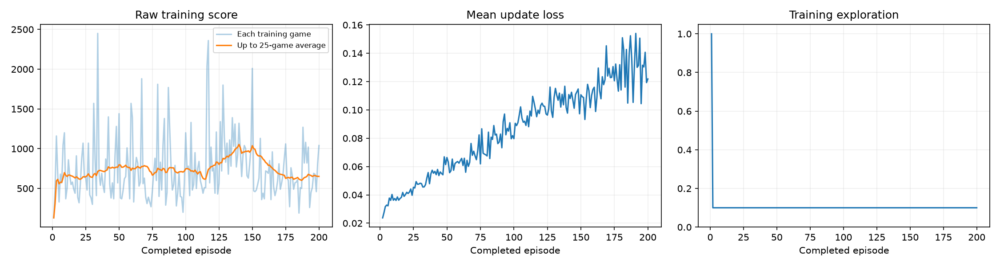
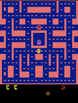
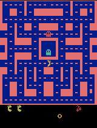

# Class 3: Training a Ms. Pac-Man DQN Agent

This repository is my Class 3 submission: a Deep Q-Network (DQN) trained on `ALE/MsPacman-v5` using the
class-provided [`pacman_dqn.ipynb`](pacman_dqn.ipynb) notebook. The executed notebook (with all outputs
visible) is committed as-is, and the evidence it produced is copied into [`results/`](results/) so it can
be inspected without rerunning anything.

An earlier 5-episode "setup check" run is described in the notebook's git history (see
[commit 4e6ae66](https://github.com/Cisco071/class3-pacman-dqn/commit/4e6ae66)) — this README documents
the current, longer 200-episode run.

## How to open and run it

1. Clone this repository.
2. Local Jupyter/VS Code: create a Python 3.11–3.13 environment, `pip install -r requirements.txt`, open
   `pacman_dqn.ipynb`, and select that kernel.
3. Or use Colab: [Open this notebook in Google Colab](https://colab.research.google.com/github/Cisco071/class3-pacman-dqn/blob/main/pacman_dqn.ipynb)
   (select Runtime → Change runtime type → T4 GPU if available).
4. Edit the three values in section 1 (already set below for this run) and choose **Run All**.

## My three hyperparameters

| Setting | Value | Why I chose it |
|---|---|---|
| Exploration | **0.10** | After a first 5-episode check run at 5% exploration, I raised this to 10% so the agent keeps sampling alternative actions during training instead of locking onto an early, possibly-bad policy — a modest increase, still far more greedy than the notebook's 0.20 starting point, since I didn't want training to be dominated by random moves over 200 episodes. |
| Episodes | **200** | This is the single biggest lever for real learning: 200 episodes is enough to (a) cross the notebook's 25-episode threshold for periodic checkpoints/GIFs, so I can see the policy change over time, and (b) accumulate over 30,000 learning updates instead of the few hundred a 5-episode check run produces. |
| Learning rate | **0.0001** | Kept at the assignment's stable reference value. With many more episodes now in play, I didn't want to add the risk of instability from a higher learning rate on top of a longer run. |

I also changed one "fixed classroom setting" beyond the three required choices, with the reasoning
documented in the notebook itself: **`REPLAY_CAPACITY`** was raised from 5,000 to 20,000 decisions, so a
200-episode run's replay buffer (122,653 total decisions collected) wouldn't evict older experience before
the agent had a chance to learn from it. Every other fixed setting (batch size, warm-up steps, target
sync, gamma, frame skip, evaluation seeds/exploration) was left at the notebook's defaults — see
[`results/config.json`](results/config.json) for the exact values used.

## What I expected vs. what I observed

**Expected:** I expected mean evaluation score to improve over the untrained baseline, since 200 episodes
gives the network thousands of learning updates instead of a few hundred. I still expected some noise,
given the comparison uses only 5 evaluation games per side.

**Observed:** Mean score rose from **492.0 (untrained) to 760.0 (trained)** — a **+268 (+54%)** improvement
that is large enough to not be pure evaluation noise (compare to the earlier 5-episode run, where the
before/after means were 492.0 vs. 550.0, essentially noise). Four of the five trained scores matched or
beat their untrained counterparts; only one seed (404: 800 → 400) got worse. But the improvement was not
monotonic: the training dashboard's 25-game rolling average rose from about 600 to a peak near 1,000 around
episode 140, then drifted back down to roughly 650–700 by episode 200, and training loss kept climbing
throughout rather than settling — expected for DQN, since the target network's Q-value estimates keep
shifting as the network itself changes. Watching the periodic gameplay GIFs, the agent visibly moves with
more direction and reacts to nearby ghosts by episode 100+, compared to the more erratic movement at
episode 0.

## Actual run stats (from `results/training_summary.json` and `results/config.json`)

- **Completed episodes:** 200 / 200 requested (not interrupted)
- **Total decisions:** 122,653
- **Learning updates:** 30,414
- **Elapsed time:** ~361 seconds (~6 minutes) including periodic-demo overhead
- **Hardware:** Apple Silicon (Apple M5), device `mps` (PyTorch's Metal backend), macOS 26.6.2 arm64
- **Software:** Python 3.13.15, PyTorch 2.14.0, Gymnasium 1.3.0, ale-py 0.11.2, NumPy 2.5.3

Since this run completed 200 episodes (well over the 25-episode threshold), the notebook produced
intermediate gameplay GIFs and checkpoints every 25 episodes, all included below / in `results/`.

## What the agent observes, does, and is rewarded for

- **Observations:** The agent does not see game "state" directly — it sees pixels. Each of its screens
  is a stack of the last 4 game frames, converted to grayscale and resized to 84×84 pixels. Stacking 4
  frames lets the network infer motion (e.g., which way a ghost is moving) from a single snapshot.
- **Actions:** The agent chooses one of 9 discrete joystick actions (no-op plus the 8 directions Ms.
  Pac-Man's joystick supports). One chosen action is held for 4 emulator frames ("frame skip") before the
  agent decides again.
- **Rewards:** The reward at each step is the change in the game's own score — eating a dot, a power
  pellet, a fruit, or a frightened ghost all add points; losing is not directly penalized beyond the game
  ending. During training only, rewards are clipped to [-1, 1] to keep learning stable; all scores reported
  here (training curve and evaluation) are the raw, unclipped game score.
- **Learning signal:** A convolutional Q-network predicts a value for each of the 9 actions given the
  current 4-frame stack. It's trained with experience replay (sampling past transitions instead of only
  the most recent one) and a separate, periodically-synced target network, using a Huber loss against a
  discounted (`gamma = 0.99`) reward target — standard DQN (Mnih et al., 2015).

## One limitation and one next experiment

**Limitation:** Training was not stable or monotonic. The 25-game rolling average peaked around episode
140 and declined afterward, and training loss never converges — it keeps climbing for the full 200
episodes. That means the final checkpoint (`trained.pt`, the one actually evaluated) is not guaranteed to
be the best-performing checkpoint seen during the run; a mid-run checkpoint (e.g., around episode 125–150)
might score higher, but the assignment's evaluation protocol correctly evaluates the true final model
rather than letting me cherry-pick a checkpoint after the fact.

**Next experiment:** The single setting I'd change next is **episodes**, raising it from 200 to 500–1,000
while keeping exploration (0.10) and learning rate (0.0001) fixed. That would show whether more experience
lets the score keep climbing past the episode-140 peak instead of drifting back down, and whether training
loss eventually plateaus instead of continuing to rise.

## Evidence

### Training dashboard (score, loss, exploration)

### Gameplay: untrained vs. best trained (first 20 seconds, 4× speed)

| Untrained (before training) | Best trained (after training) |
|---|---|
|  |  |

### Intermediate gameplay every 25 episodes

Since this run reached 200 episodes (≥ 25), the notebook saved a gameplay sample every 25 episodes,
showing the policy change over the course of training:

| Episode 25 | Episode 50 | Episode 75 | Episode 100 |
|---|---|---|---|
|  |  |  |  |

| Episode 125 | Episode 150 | Episode 175 | Episode 200 |
|---|---|---|---|
|  |  |  |  |

### All five before/after evaluation scores

Same 5 seeds, same 5% evaluation exploration, same step cap, before and after training. Baseline is an
**untrained network**, not a random-action agent. Full data: [`results/comparison.json`](results/comparison.json).

| Seed | Untrained score | Trained score |
|---|---|---|
| 101 | 350.0 | 640.0 |
| 202 | 500.0 | 560.0 |
| 303 | 320.0 | 1590.0 |
| 404 | 800.0 | 400.0 |
| 505 | 490.0 | 610.0 |
| **Mean** | **492.0** | **760.0** |

### Files

- Executed notebook with outputs: [`pacman_dqn.ipynb`](pacman_dqn.ipynb)
- Run config (hyperparameters, hardware, package versions): [`results/config.json`](results/config.json)
- Per-episode training log (all 200 episodes): [`results/training.csv`](results/training.csv)
- Training run totals: [`results/training_summary.json`](results/training_summary.json)
- Before/after evaluation scores: [`results/comparison.json`](results/comparison.json)
- Untrained baseline evaluation only: [`results/baseline.json`](results/baseline.json)

Model checkpoints (`untrained.pt`, `trained.pt`, and periodic `episode_00NN.pt` files, ~6.5 MB each) and
the full run folder are kept locally under `pacman_runs/20260915_232220_016086/` (git-ignored per the
notebook's default `.gitignore`) rather than committed to this repository, per the assignment's guidance
to keep large checkpoints out of the repo.

## Credits

Notebook and DQN implementation from the class-provided [pacman-dqn](https://github.com/pepealonso95/pacman-dqn)
starter repository.
